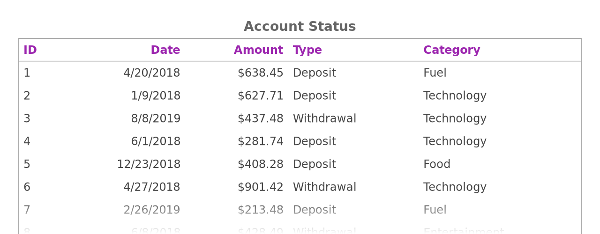

# Canvas Table
Fast table implementation in Canvas

## Screenshots



## Installation

```
npm i canvas-table
```

## Usage

### Usage in NodeJS

```ts
import { CanvasTable, CTConfig } from "canvas-table";
import { createCanvas } from "canvas";

const canvas = createCanvas(640, 250);
const config: CTConfig = { columns, data };
const ct = new CanvasTable(canvas, config);
await ct.generateTable();
await ct.renderToFile("test-table.png"); // You can get the buffer with renderToBuffer
```

### Usage in Browser

```ts
import { CanvasTable, CTConfig } from "canvas-table";

const canvas = document.getElementById("#canvas");
const config: CTConfig = { columns, data };
const ct = new CanvasTable(canvas, config);
await ct.generateTable();
// const blob = await ct.renderToBlob();
```

## Configuration

**config** (required)

```ts
const config: CTConfig =
{
    data: CTData;
    columns: CTColumn[];
    options?: CTOptions;
};
```

**data** (required)

```ts
const data: CTData = [
    ["cell 1", "cell 2", "cell 3"], // row 1
    ["cell 1", "cell 2", "cell 3"] // row 2
];
```

**columns** (required)

```ts
const columns: CTColumns = [
    {title: "Column 1"},
    {title: "Column 2", options: { textAlign: "center" }},
    {
        title: "Column 3",
        options: {
            textAlign: "right", 
            fontSize: 14,
            fontWeight: "bold",
            fontFamily: "serif",
            color: "#444444",
            lineHeight: 1
    	}
    }
];
```

**options** (optional)

```ts
const options: CTOptions = {
    borders: {
        column: undefined,
        header: undefined,
        row: { width: 1, color: "#555" },
        table: { width: 2, color: "#aaa" }
    }
}
```

*defaultOptions*

```ts
const defaultOptions: CTInternalOptions = {
    borders: {
        header: { color: "#ccc", width: 1 }
    },
    header: {
        fontSize: 12,
        fontWeight: "bold",
        fontFamily: "sans-serif",
        color: "#666666",
        lineHeight: 1.2,
        textAlign: "left",
        padding: 5
    },
    cell: {
        fontSize: 12,
        fontWeight: "normal",
        fontFamily: "sans-serif",
        color: "#444444",
        lineHeight: 1.2,
        padding: 5,
        textAlign: "left"
    },
    background: "#ffffff",
    devicePixelRatio: 2,
    fader: {
        right: true,
        size: 40,
        bottom: true
    },
    fit: false,
    padding: {
        bottom: 20,
        left: 20,
        right: 20,
        top: 20
    },
    subtitle: {
        fontSize: 14,
        fontWeight: "normal",
        fontFamily: "sans-serif",
        color: "#888888",
        lineHeight: 1,
        // text: "",
        textAlign: "center"
    },
    title: {
        fontSize: 14,
        fontWeight: "bold",
        fontFamily: "sans-serif",
        color: "#666666",
        lineHeight: 1,
        // text: "",
        textAlign: "center"
    }
};
```


## Development

Initialize your environment with

```
npm i
```

To build:

```
npm run build
```

To run the tests:

```
npm run test
```